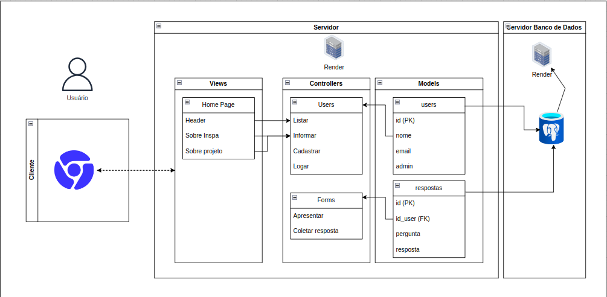
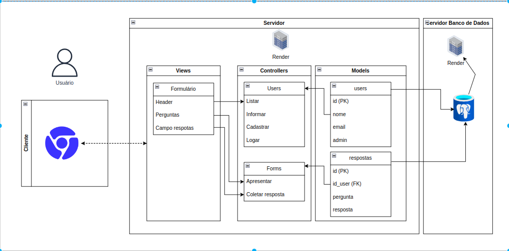
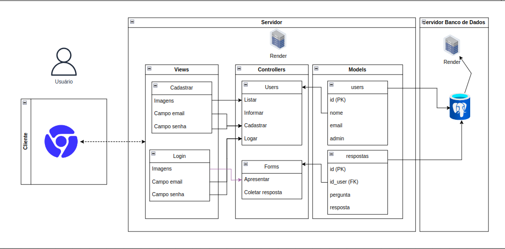

# Arquitetura MVC
- Nome do Projeto: Abandono 0
- Descrição: Aplicação web para coletar dados de pessoas que possuem animais de estimação (pets) e apresentá-los intuitivamente aos pesquisadores.
- Arquitetura: MVC (Model-View-Controller)
- Ferramenta de Diagramação: draw.io

### Modelos (Models):
- users (id, nome, email, admin)
O modelo user relaciona-se ao Controller Users, de modo que é onde ficará registrado as informações dos usuários.

- respostas (id, id_user, pergunta, resposta)
O modelo respostas relaciona-se ao Controller Forms, de modo que é onde ficará registrado as respostas de cada pergunta respondida pelo usuário.

### Controladores (Controllers):
- Liste os controladores do seu projeto e suas responsabilidades.
- Users:
  É o controlador que irá cuidar dos usuários, responsável por listar as informações e registrá-las, informar o usuário o que for necessário, cadastrar um usuário novo e logar o usuário no site. Cada uma dessas se relaciona com uma ou mais páginas do site, representadas nas views, assim como cada método também se relaciona com o modelo "Users" descrito acima.

- Forms:
  São os formulários que deverão ser respondidos pelo usuário, sendo o controlador responsável por apresentar as informações/perguntas na tela e coletar as respostas do usuário, armazenando-as no banco de dados.

### Views (Views):
- Home Page:
  É a página inicial que será exibida pela aplicação. Nela estarão contidos: um header onde haverá uma barra de navegação, um local onde haverá informações sobre o INSPA e um local onde haverá informações sobre o projeto Abandono - em si.

- Formulário:
  É a página que serão exibidos os formulários a serem respondidos pelo usuário. Nela estarão contidos: um header onde haverá uma barra de navegação, um campo de perguntas e um campo de respostas para que o usuário responsa à pergunta.

- Cadastrar:
  É a página onde o usuário deverá entrar caso precise criar uma nova conta. Nela estarão contidos: imagens para um melhor desig; um campo para o usuário inserir seu email, relacionando-se ao controller Users; e um campo para o usuário inserir sua senha que irá utilizar, também relacionando-se ao controller Users.

- Login:
  É a página onde o usuário deverá colocar suas credenciais para entrar em sua conta caso já tenha uma. Ela possui os mesmos atributos do cadastro, com as mesmas ligações, sendo que o que mudará será o tipo de requisição para o banco de dados.

### Infraestrutura:
A aplicação possui um banco de dados relacional, conectado diretamente ao servidor. O banco de dados estará ligado aos models da arquitetura MVC, que representam de forma abstrata as tabelas que serão criadas.

### Justifique as escolhas feitas e como elas impactam o projeto.
#### Implicações da Arquitetura:
O código estruturado com uma arquitetura MVC possui uma vantagem muito grande em questão de manutenção, pois como a arquitetura separa as responsabilidades de cada parte, assim, ao detectar um problema e em qual camada ele está, basta acessá-la para fazer uma manutenção, o que o leva a ter escalabilidade e estabilidade melhroes.

### Arquitetura:

